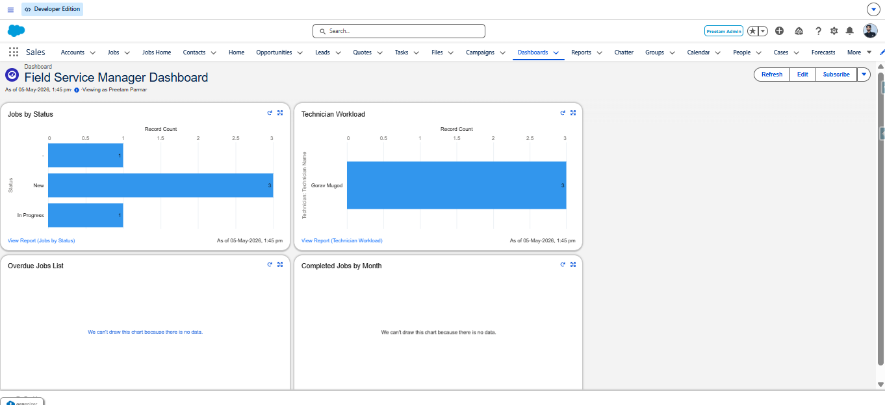
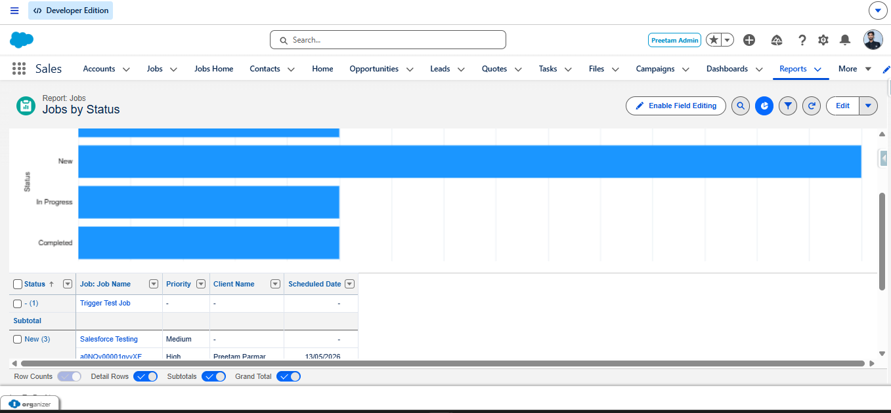

# ⚡ Field Service CRM — Salesforce Developer Project

<div align="center">


**A fully functional Field Service CRM built on Salesforce — featuring custom objects, automation flows, Apex triggers, batch processing, LWC dashboards, and a complete Lightning App.**

[View Project](#-project-overview) • [Features](#-features) • [Tech Stack](#-tech-stack) • [Screenshots](#-screenshots) • [Setup](#-setup--deployment) • [Structure](#-project-structure)

</div>

---

## 📌 Project Overview

**Field Service CRM** is a real-world Salesforce CRM application designed to manage field service operations — including job creation, technician assignment, scheduling, overdue tracking, and performance reporting.

Built as a **14-day Salesforce Developer project**, it demonstrates end-to-end Salesforce development skills across declarative and programmatic tools.

> 🔗 **Org Type:** Salesforce Developer Edition  
> 👤 **Developer:** Preetam Parmar  
> 📅 **Project Duration:** 14 Days  

---

## ✅ Features

### 🗂️ Data Model
- 4 Custom Objects: `Job__c`, `Technician__c`, `Job_Assignment__c`, `Service_Report__c`
- Custom fields, relationships, validation rules, and page layouts

### ⚙️ Automation (Flows)
- **Job Assignment Notification Flow** — Notifies technicians when a job is assigned
- **Job Intake Wizard (Screen Flow)** — Guided multi-step form for creating new jobs
- **Daily Overdue Jobs Scheduled Flow** — Automatically flags overdue jobs every day

### 🧠 Apex Development
- **Apex Trigger + Handler** — Handles job status changes and assignment logic
- **Test Class** — Full code coverage for trigger logic
- **Batch Apex Class** — Processes large volumes of overdue/completed jobs
- **Batch Scheduler** — Schedules the batch job for automated execution

### 🖥️ Lightning Web Components (LWC)
- **Job Dashboard** — Real-time view of all jobs by status with filters
- **Job Timeline** — Visual timeline of jobs per technician

### 📊 Reports & Dashboards
- **Jobs by Status** — Bar chart showing job distribution across statuses
- **Technician Workload** — Workload distribution per technician
- **Overdue Jobs List** — Table of overdue jobs with priority and client info
- **Completed Jobs by Month** — Monthly completion trend chart

### 🌩️ Lightning App
- Custom **Field Service CRM** Lightning App
- Navigation: Home, Jobs, Technicians, Job Assignments, Service Reports, Reports, Dashboards

---

## 🛠️ Tech Stack

| Layer | Technology |
|---|---|
| Platform | Salesforce (Developer Edition) |
| Data Layer | Custom Objects, SOQL, SOSL |
| Automation | Screen Flow, Record-Triggered Flow, Scheduled Flow |
| Backend | Apex Triggers, Apex Batch, Apex Scheduler |
| Frontend | Lightning Web Components (LWC) |
| UI | Lightning App Builder, Lightning Experience |
| Reports | Salesforce Reports & Dashboards |
| Version Control | Git + GitHub |
| Deployment | Salesforce CLI (sf / sfdx) |

---

## 📸 Screenshots

### 🏠 Field Service Manager Dashboard

> Complete dashboard with all 4 charts — Jobs by Status, Technician Workload, Overdue Jobs List, Completed Jobs by Month

### 📊 Jobs by Status Report


### 👷 Technician Workload Report


### ⚠️ Overdue Jobs List Report


### 📅 Completed Jobs by Month Report


---

## 📁 Project Structure

```
FieldServiceCRM/
│
├── force-app/
│   └── main/
│       └── default/
│           ├── objects/                   # Custom Objects & Fields
│           │   ├── Job__c/
│           │   ├── Technician__c/
│           │   ├── Job_Assignment__c/
│           │   └── Service_Report__c/
│           │
│           ├── flows/                     # Automation Flows
│           │   ├── Job_Assignment_Notification_Flow
│           │   ├── Job_Intake_Wizard
│           │   └── Daily_Overdue_Jobs_Flow
│           │
│           ├── classes/                   # Apex Classes
│           │   ├── JobTriggerHandler.cls
│           │   ├── JobTriggerHandlerTest.cls
│           │   ├── OverdueJobsBatch.cls
│           │   └── OverdueJobsBatchScheduler.cls
│           │
│           ├── triggers/                  # Apex Triggers
│           │   └── JobTrigger.trigger
│           │
│           ├── lwc/                       # Lightning Web Components
│           │   ├── jobDashboard/
│           │   └── jobTimeline/
│           │
│           ├── applications/             # Lightning App
│           │   └── Field_Service_CRM.app
│           │
│           └── Screenshot/               # Reports & Dashboard screenshots (manual)
│               ├── manager-dashboard.png
│               ├── Jobs-By-Status-Reports.png
│               ├── Technician Workload Reports.png
│               ├── Overdue Jobs By list.png
│               └── Completed jobs by month -Reports.png
│
├── .forceignore
├── sfdx-project.json
└── README.md
```

---

## 🚀 Setup & Deployment

### Prerequisites
- Salesforce Developer Edition Org ([Sign up free](https://developer.salesforce.com/signup))
- [Salesforce CLI](https://developer.salesforce.com/tools/salesforcecli) installed
- [VS Code](https://code.visualstudio.com/) with Salesforce Extension Pack

### Steps

**1. Clone the Repository**
```bash
git clone https://github.com/preetam0101/field-service-crm.git
cd field-service-crm
```

**2. Authorize Your Salesforce Org**
```bash
sf org login web --alias FieldServiceCRM
```

**3. Deploy to Org**
```bash
sf project deploy start --target-org FieldServiceCRM
```

**4. Assign Permission Set (if applicable)**
```bash
sf org assign permset --name Field_Service_CRM_Access --target-org FieldServiceCRM
```

**5. Open the Org**
```bash
sf org open --target-org FieldServiceCRM
```

**6. Navigate to the App**
> Click the App Launcher → Search **"Field Service CRM"** → Open

---

## 🗓️ Project Timeline

| Day | Task | Status |
|-----|------|--------|
| Day 1 | Project Setup & GitHub | ✅ Done |
| Day 2–3 | 4 Custom Objects & Fields | ✅ Done |
| Day 4 | Job Assignment Notification Flow | ✅ Done |
| Day 5 | Job Intake Wizard Screen Flow | ✅ Done |
| Day 6 | Daily Overdue Jobs Scheduled Flow | ✅ Done |
| Day 7 | Apex Trigger, Handler & Test Class | ✅ Done |
| Day 8 | Apex Batch Class & Scheduler | ✅ Done |
| Day 9 | LWC Job Dashboard | ✅ Done |
| Day 10 | LWC Job Timeline | ✅ Done |
| Day 11 | Reports & Dashboard | ✅ Done |
| Day 12 | Lightning App | ✅ Done |
| Day 13 | Code Cleanup & Documentation | ✅ Done |
| Day 14 | README & GitHub Showcase | ✅ Done |

---

## 🧑‍💻 Author

**Preetam Parmar**  
Salesforce Developer  

[](https://github.com/preetam0101)

---

## 📄 License

This project is open-source and available under the [MIT License](LICENSE).

---

<div align="center">
  <sub>Built with ❤️ on Salesforce Developer Edition</sub>
</div>
